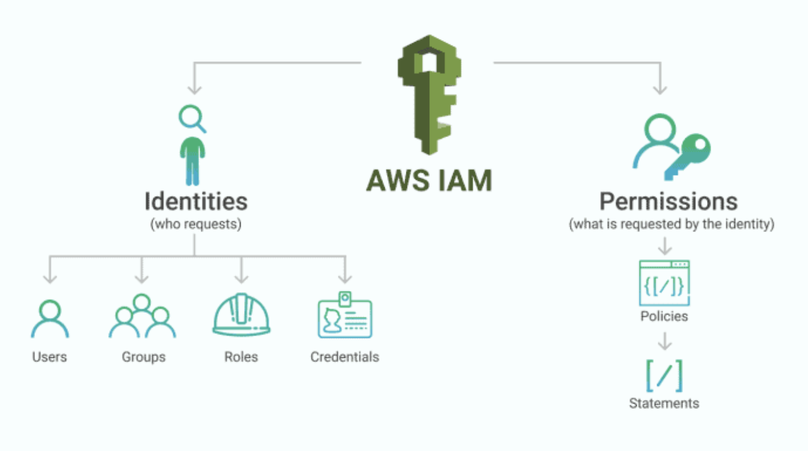

# SSO IAM Best Practice



## Must Needs

1. Terraform ~>= 1.6

```sh
    brew install tfenv ## nvm 같은 패키지 매니저

    ## zsh
    git clone https://github.com/tfutils/tfenv.git ~/.tfenv
    echo 'export PATH="$HOME/.tfenv/bin:$PATH"' >> ~/.zshrc
    ~/.zshrc

    ## tfenv를 사용해서 terraform 최신버전 설치
    tfenv install
```

2. Identity Center 활성화
    - AWS Identity Center 구성

